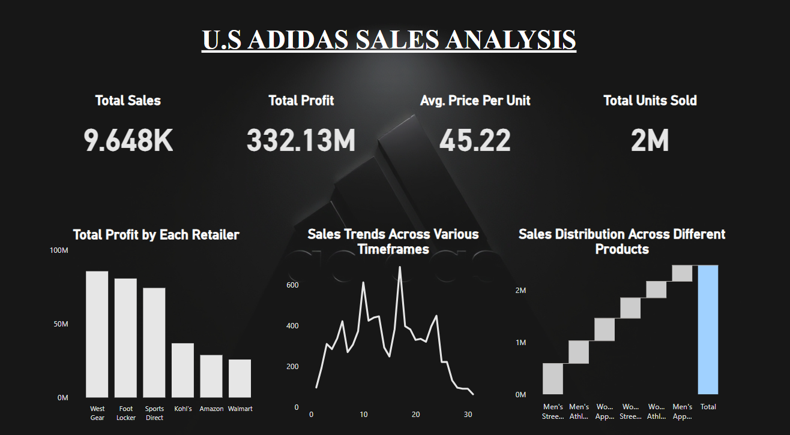
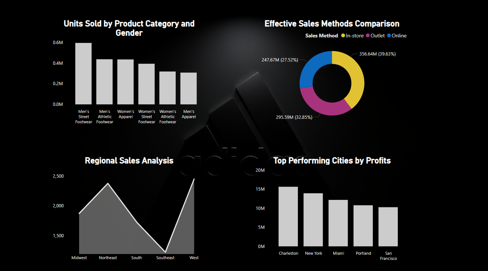

# Adidas U.S. Sales Analysis Dashboard

This project focuses on analyzing the U.S. sales data of Adidas and creating an interactive dashboard using Power BI to provide actionable insights for business decision-making. The dashboard highlights key performance indicators (KPIs), sales trends, and detailed analysis of sales and profitability across various dimensions.

## Project Workflow

### 1. **Dataset Overview**
- **Source**: Adidas U.S. sales dataset containing 10,000 rows and columns such as retailer, retailer ID, invoice date, region, state, city, product, price per unit, units sold, total sales, operating profit, operating margin (%), and sales method.
- **Objective**: Transform raw sales data into meaningful insights through interactive visualizations.

### 2. **Data Preprocessing**
- **Tools Used**: Power BI’s data transformation tools (Power Query).
- **Steps**:
  - Imported the dataset into Power BI.
  - Cleaned and formatted the data by:
    - Removing duplicates and handling missing values.
    - Splitting and reorganizing columns for better usability.
    - Standardizing date formats for time-series analysis.
    - Creating calculated columns and measures for metrics like Total Sales, Total Profit, Profit Margin, and Average Price Per Unit.

### 3. **Dashboard Creation**
- **Visualizations Included**:
  1. **Top Sales and Total Profit**:
     - Identified best-performing products and regions by total sales and profit.
     - Visuals: Bar Charts and Pie Charts.
  2. **Average Price Per Unit and Total Units Sold**:
     - Highlighted pricing strategies and unit sales performance.
     - Visuals: KPI Cards and Line Charts.
  3. **Total Profit by Retailer**:
     - Evaluated profitability contribution from each retailer.
     - Visuals: Stacked Bar Charts and Tables.
  4. **Sales Trends**:
     - Analyzed sales performance over time (monthly, quarterly, yearly).
     - Visuals: Line Charts and Area Charts.
  5. **Sales Distribution Across Regions**:
     - Displayed the distribution of sales across U.S. regions and states.
     - Visuals: Map Charts and Heatmaps.
  6. **Effective Sales Methods**:
     - Compared sales performance across different sales channels or methods.
     - Visuals: Column Charts and Pie Charts.
  7. **Regional Sales Analysis**:
     - Deep-dived into region-specific sales metrics.
     - Visuals: Geospatial Maps with drill-through capabilities.

### 4. **Key Insights**
- Identified top-performing products, regions, and retailers driving maximum sales and profits.
- Observed seasonal sales trends and identified peak sales periods.
- Analyzed regional disparities in sales, highlighting growth opportunities in underperforming regions.
- Compared sales methods to determine the most effective strategies.

### 5. **Interactive Features**
- **Drill-through and Filters**: Enabled users to explore sales data by time, region, retailer, and product category.
- **Dynamic Visuals**: Provided real-time updates for KPIs based on user interaction.
- **Custom Tooltips**: Added detailed information for data points on hover.

### 6. **Technologies Used**
- **Tools**: Power BI
- **Features**: Power Query for data transformation, DAX (Data Analysis Expressions) for calculated measures, and visualization tools for dashboard creation.

### 7. **Conclusion**
This project successfully demonstrates the power of data visualization in uncovering actionable insights from sales data. The interactive dashboard not only highlights key business metrics but also enables stakeholders to make informed decisions regarding product performance, regional strategies, and sales methods.
